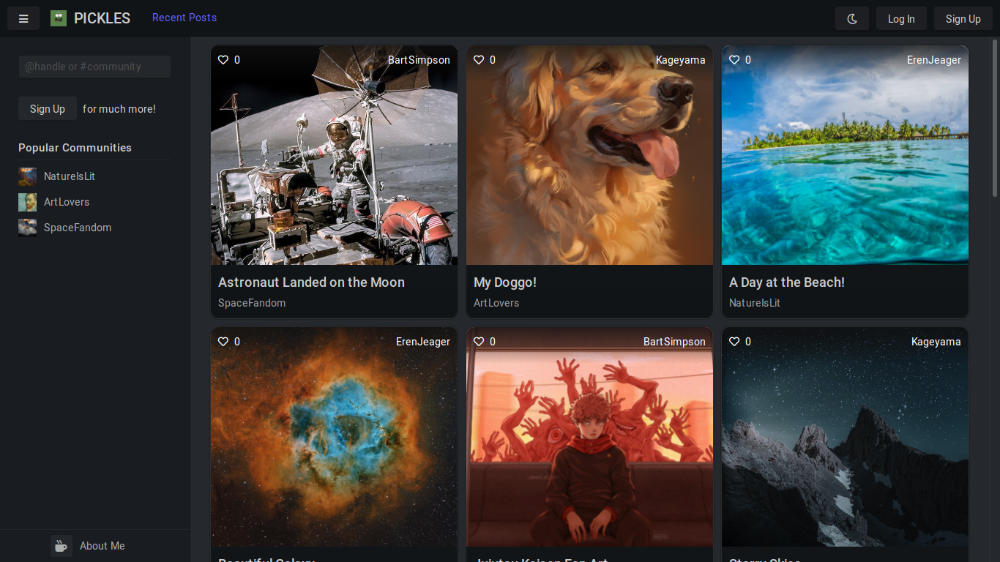
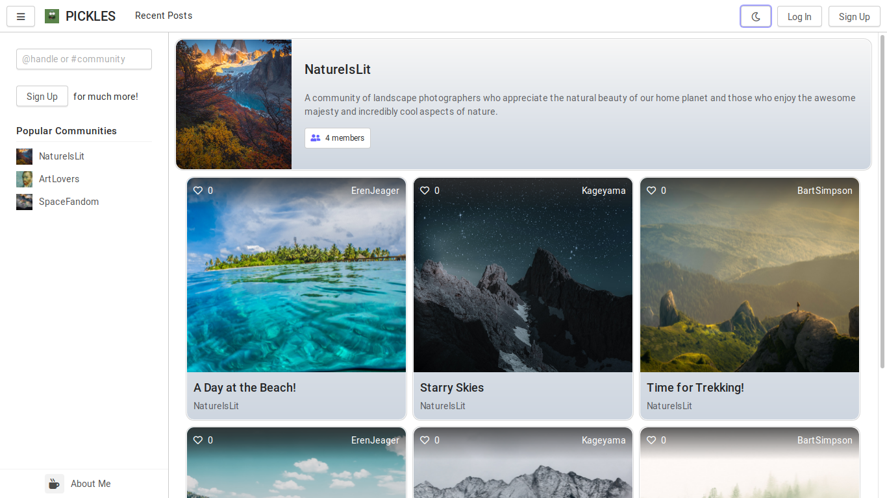
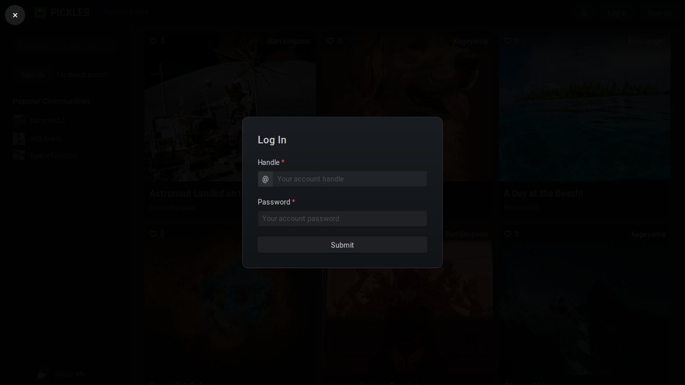
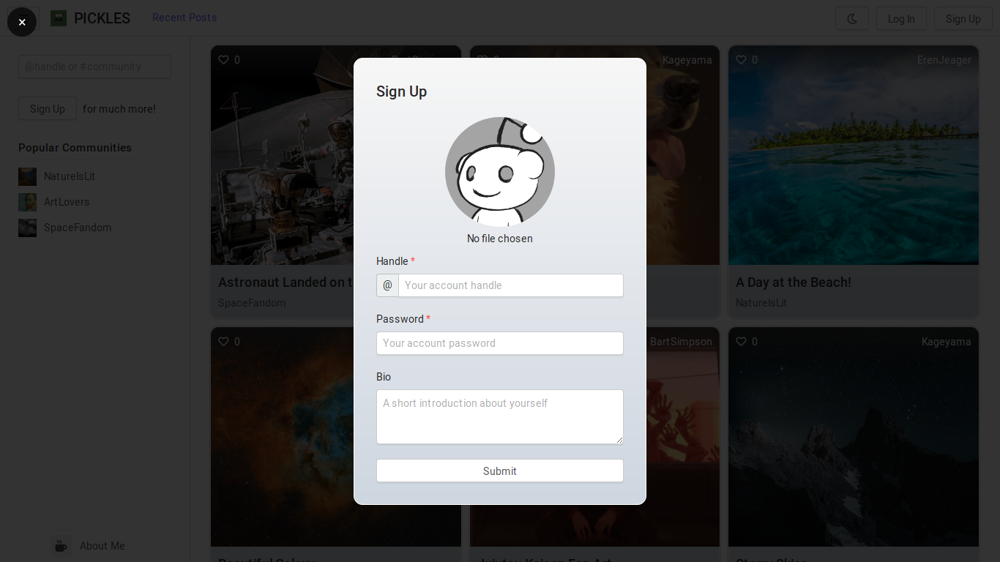
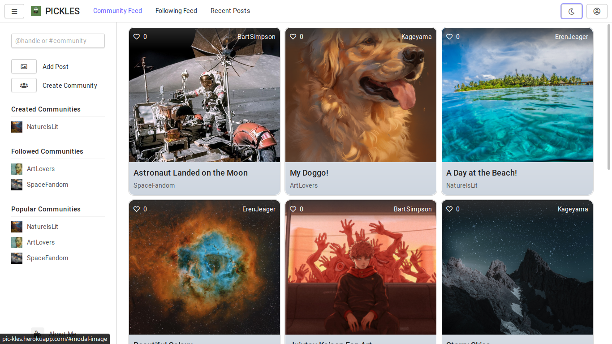
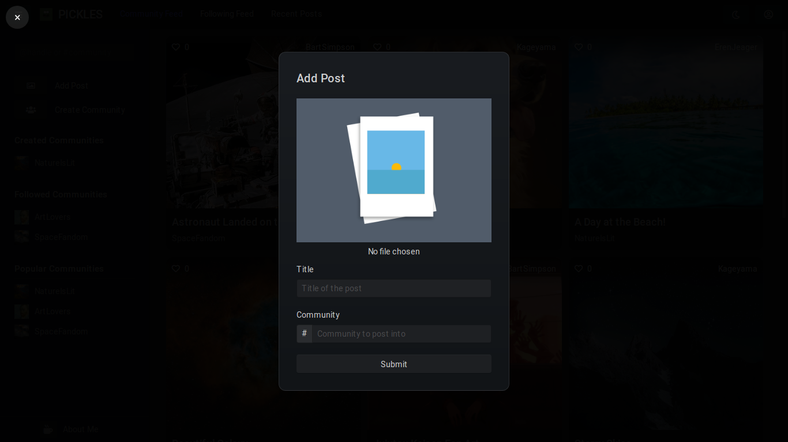
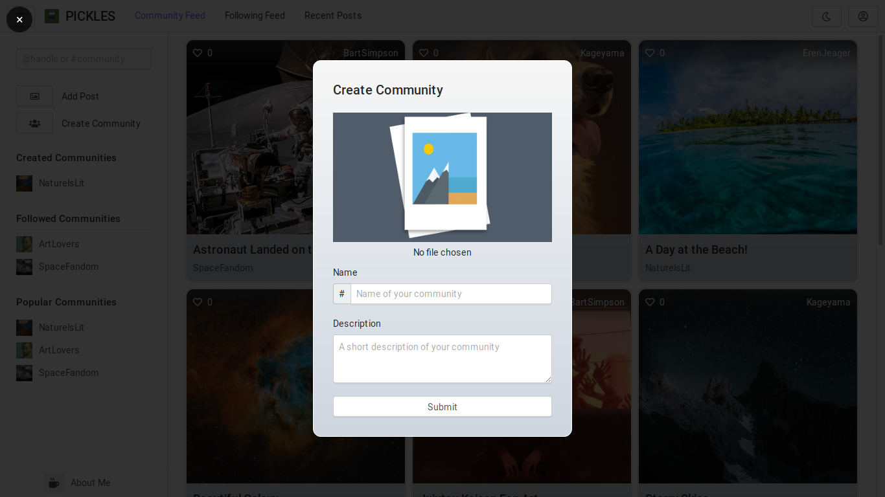

# PICKLES

Let your mind speak through images!

Pickles is an image sharing website that allows users to add posts inside communities of like minded people.

It's completely responsive dual theme design provides amazing viewing experience across all devices! Add posts, create communties, follow communities, view posts curated for you and much more!

<div align="center">
    
    
    
    
    
    
    
</div>

## Development

The front-end of the website has been made using the following tools and libraries,

-   [Handlebars](https://handlebarsjs.com/) and HTML for templates
-   [Halfmoon](https://www.gethalfmoon.com/) and CSS for styling
-   [JQuery](https://jquery.com/) and Javascript for interactivity
-   [Font Awesome](https://fontawesome.com/) for icons

The back-end has been made using,

-   NodeJS and ExpressJS for routing
-   [Mongoose](https://mongoosejs.com/), MongoDB and MongoDB Atlas for managing database
-   [Multer](https://www.npmjs.com/package/multer) and [Cloudinary](https://cloudinary.com/) for managing file uploads
-   [Bcrypt](https://www.npmjs.com/package/bcrypt) for encypting passwords
-   [Express Session](https://www.npmjs.com/package/express-session) and [Connect Mongo](https://www.npmjs.com/package/connect-mongo) for maintaining session storage on MongoDB

The website has been hosted using Heroku. To run website on local server,

1. Clone the project into your local machine. All futher steps to continue from within root path of the project folder.
2. Initialize `npm` using,

    ```bash
    npm init
    ```

3. Install all dependencies using,

    ```bash
    npm install
    ```

4. Set the following environment variables ([`dotenv`](https://www.npmjs.com/package/dotenv) package is recommended),

    - `CLDNRY_NAME` - Name of Cloudinary storage
    - `CLDNRY_API_KEY` - API key for Cloudinary storage
    - `CLDNRY_API_SECRET` - API secret of Cloudinary storage
    - `DB_URL` - MongoDB database URL
    - `STORE_URL` - MongoDB session store URL
    - `STORE_SECRET` - Session storage secret

5. Run the application using,

    ```bash
    npm start
    ```
